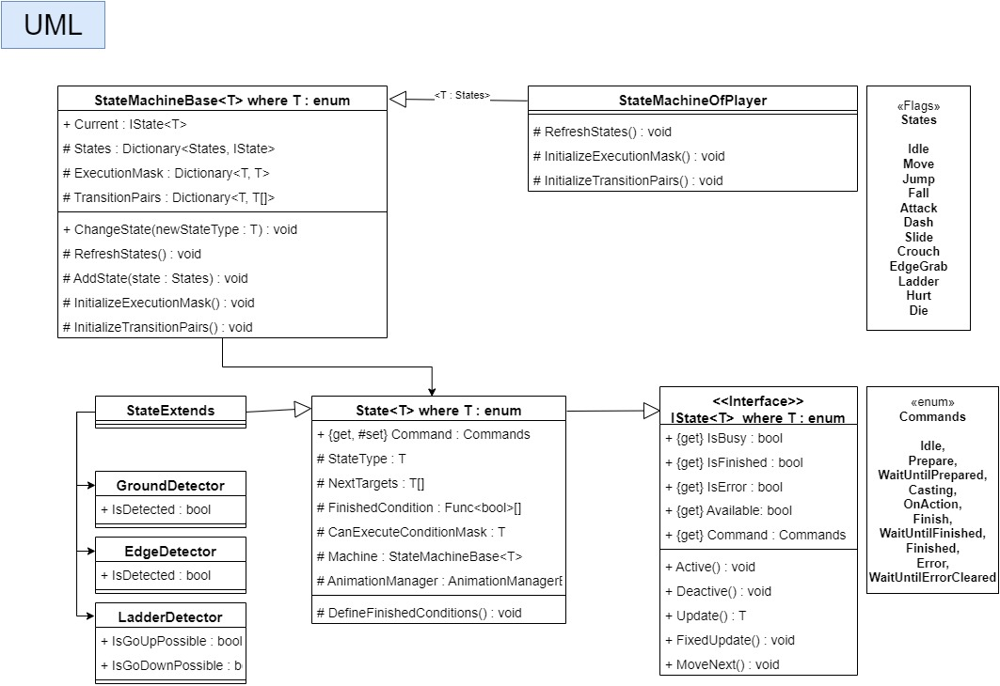
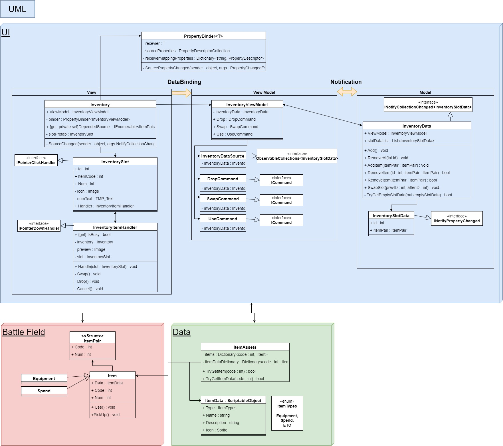

# DataAnalyzer

## Intro :
Unity custom editor test for data analyzer

## How it works :
* This custom editor window is being made for helping developer to debug unity objects easier.
* Just drag and drop objects to the window and select the fields/properties you want to visualize.
* Since it is still in the early stages of development, many features and conveniences have not been implemented.

## Functions implemented :
* Click or drag the graph so can debug value at selected frame.
* Move to previous/next frame with "Left-Arrow"/"Right-Arrow" key.
* Indivisual color settings.
* Graph resolution settings.

## Additional implementations for testing :

### Character FSM 
* There're 2 versions. Generic concept & Dynamic concept.
* Generic concept below 

### Inventory System
* Inventory System of MVVM pattern.

